# Lab1

为FIR滤波程序，核心代码如下：

````
	Vector#(8, Reg#(Sample)) r <- replicateM(mkReg(0));
    Vector#(9, Multiplier) mul <- replicateM(mkMultiplier());

    rule shift_and_mul (True);
        Sample sample = infifo.first();
        infifo.deq();
        r[0] <= sample;
        for (Integer i=0; i<7; i=i+1) begin
            r[i+1] <= r[i];
        end
       mul[0].putOperands(c[0], sample);
       for (Integer i=0; i<8; i=i+1) begin
          mul[i+1].putOperands(c[i+1], r[i]);
       end
    endrule

    rule do_sum;
        FixedPoint#(16,16) accumulate = 0;
        for (Integer i=0; i<9; i=i+1) begin
            let t <- mul[i].getResult;
            accumulate = accumulate + t;
        end
        outfifo.enq(fxptGetInt(accumulate));
    endrule
````

编译仿真程序：


仿真结果：


生成Verilog程序：


# Lab2

实验给出了FFT的combinational实现，要求改为pipeline形式和fold形式。并且通过模块带参数实现不同tap数的多态FIR模块，并通过interface的参数化实现FFT模块的不同point数的多态、任意complex类型的多态。

原始Combinational FFT核心部分：

````
rule comb_fft;
    Vector#(TAdd#(1, TLog#(fft_points)), Vector#(fft_points, Complex#(cmplxd))) stage_data = newVector();
    stage_data[0] = inputFIFO.first();
    inputFIFO.deq();
    for(Integer stage = 0; stage < valueof(TLog#(fft_points)); stage=stage+1) begin
        stage_data[stage+1] = stage_f(fromInteger(stage), stage_data[stage]);  
    end
    outputFIFO.enq(stage_data[valueof(TLog#(fft_points))]);
  endrule
````

Pipeline FFT核心部分：

````
stage_data <- replicateM(mkReg(tagged Invalid));

rule do_fft;
    inputFIFO.deq();
    stage_data[0] <= tagged Valid inputFIFO.first;
    
    for(Integer stage = 0; stage < valueof(TLog#(fft_points)); stage=stage+1) begin
        case (stage_data[stage]) matches
            tagged Valid .data : stage_data[stage+1] <= tagged Valid stage_f(fromInteger(stage), data);
            tagged Invalid:  stage_data[stage+1] <= tagged Invalid;
        endcase
    end

    if (isValid(stage_data[valueof(TLog#(fft_points))]) == True) begin
        outputFIFO.enq(fromMaybe(?, stage_data[valueof(TLog#(fft_points))]));
    end    
  endrule
````

Folded FFT核心部分：

````
rule do_fft;
    Vector#(fft_points, Complex#(cmplxd)) tmp;
    let max_stage = fromInteger(valueOf(TLog#(fft_points))-1);
    stage <= (stage == max_stage)? 0 : stage + 1;

    if (stage == 0) begin
        inputFIFO.deq();
        tmp = stage_f(stage, inputFIFO.first);
        if (first_round == False) begin
            outputFIFO.enq(stage_data);
        end
        first_round <= False;
    end else begin 
        tmp = stage_f(stage, stage_data);
    end

    stage_data <= tmp;   
  endrule
````

编译仿真：


其中初次编译存在warning：


笔者认为是lab自带的combinational FFT的rule中的逻辑太复杂，unfold出来的内容太多导致，但最终能实现验证的功能

仿真结果：


生成verilog：


# Lab3

Pitch Adjust 程序测试仿真：


AutoPipeline 仿真编译：


第一个warning是关于lab自带的cordic的Fshow函数，不影响实际电路功能，第2、3个warning关于combinational FFT，仿真时使用也不影响实际功能。

AutoPipeline 仿真结果：


GetPut Interface总结：

1、是BSV中预定义的interface，提供了自动化握手的功能


2、对于接口和FIFO：


如下两种方式等效：


3、拓展：采用Server实现多态接口


# Lab4

本实验使用了kazutoiris/connectal的docker环境，并在Lab4实验目录下运行如下命令进入环境。

````
sudo docker run -i -t --volume .:/root kazutoiris/connectal
````

connectal simulation 结果：

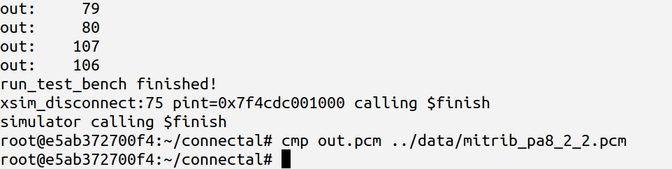

此外采用了sub interface的方法将 pitch adjuct 的 factor作为可调节的变量输入到模块中。


# Lab5

## 1 MultiCycle

**small benchmark:**

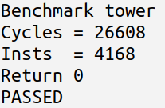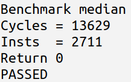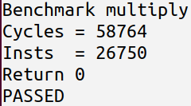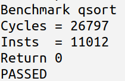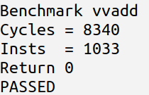

**big benchmark:**

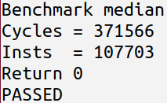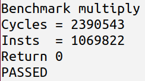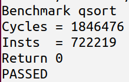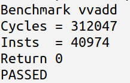

## 2 Two Stage Ehr

**small benchmark:**

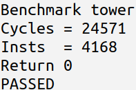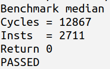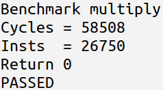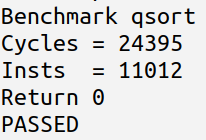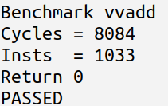

**big benchmark:**

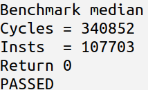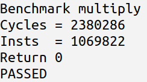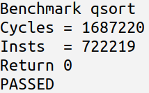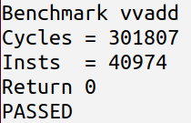

## 3 Two Stage Redir

**small benchmark:**

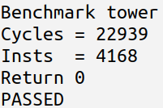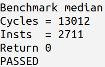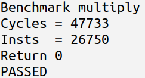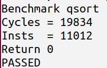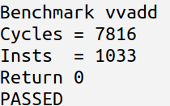

**big benchmark:**

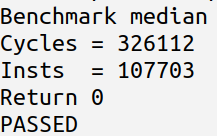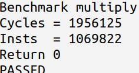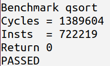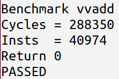

## 4 Two Stage BTB

**small benchmark:**

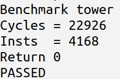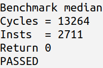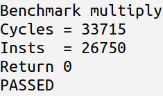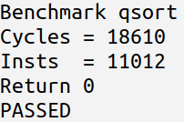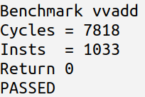

**big benchmark:**

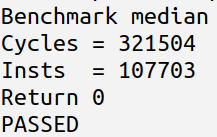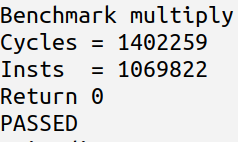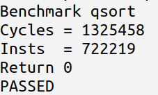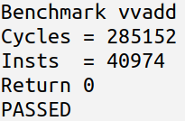
